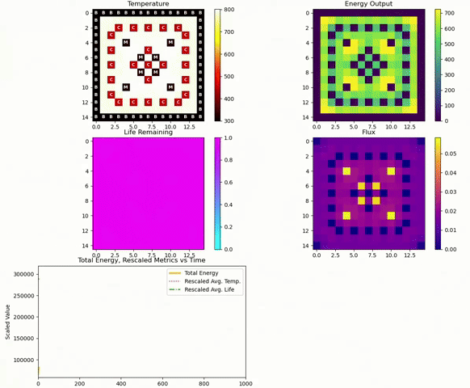
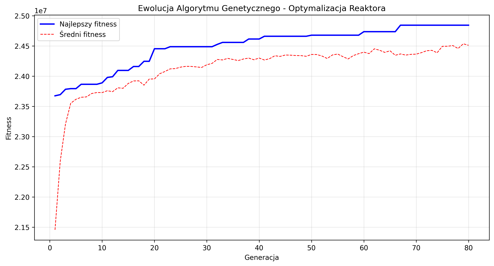

# Reactor Fuel Optimizer

A modular 2D reactor core simulator and optimizer designed to evolve fuel assembly layouts over time. It supports configurable rules, logging, and future integration with optimization algorithms (e.g., PSO, GA).

---

## 🌟 Core Features

- **Grid-based simulator**  
  - 15×15 grid of assemblies, categorized into `Fuel`, `ControlRod`, `Moderator`, and `Blank`  
  - Only `Fuel` assemblies are movable/optimizable

- **Time evolution engine**  
  - Deterministic timestep loop (up to configurable `TIMESTEPS`)  
  - Each assembly updates attributes like `temperature`, `energy_output`, `life`  

- **Flexible initialization**  
  - Load predefined layouts via JSON  
  - Generate random or uniform configurations with seeded RNG  

- **Modular physics & penalty system**  
  - Swappable models (neighbor influence rules, fitness scoring)  
  - Stubbed fitness/penalty functions for plugin integration  

- **Extensible architecture**  
  - Organized into core modules (`core_sim/`, `optimizer/`, `utils/`, `visualisation/`)  
  - Clean separation between simulation, logging, and optimization

- **Data logging & export**  
  - Built-in recorder/logger outputs:  
    - Per-timestep grid states  
    - Total energy & fitness  
    - Penalty tracking

- **Branch-based development**  
  - The `almost-there` branch holds the latest working version  
  - Stable branching strategy for collaboration & integration

---

## 🛠️ Getting Started

1. **Clone the repo**
   ```bash
   git clone https://github.com/ThomasKarpinski/reactor-fuel-optimizer.git
   cd reactor-fuel-optimizer
   git checkout almost-there
   ```

2. **Install dependencies**
   ```bash
   pip install -r requirements.txt
   ```

3. **Run a quick simulation**
   ```bash
   python main.py
   ```

## 🎨 Layout Editor

Use the visual layout editor (layout_editor.py) to design your own reactor core layouts. You can place any combination of:

- **F** — Fuel
- **C** — Control Rod
- **M** — Moderator
- **B** — Blank

Export your layout to a JSON file and run it in the simulator.

**Demo**: 


## 📊 Simulation Preview



---

# 🧬 Genetic Algorithm Optimization

## Overview

The project now includes a powerful **Genetic Algorithm (GA)** module that automatically optimizes fuel placement in the reactor core. The GA evolves populations of reactor configurations to maximize energy output while maintaining safe operating temperatures.

## 🚀 Quick Start GA

### 1. Create a base layout for optimization
```bash
python scripts/create_base_layout.py
```

### 2. Run the genetic algorithm
```bash
python main_ga.py
```

### 3. Visualize the results
```bash
python visualisation/visualize_simulation.py output/ga_optimized_[timestamp].json
```

## 📈 Evolution Process

The GA progressively improves reactor configurations over generations:



*Example evolution showing fitness improvement over 100 generations. The blue line shows the best fitness in each generation, while the red dashed line shows the population average.*

## 🧬 How the GA Works

### Chromosome Representation
Each reactor configuration is encoded as a binary string:
- `1` = Fuel assembly present
- `0` = Empty position (Blank)

Only positions marked as `Fuel` or `Blank` in the base layout are optimized. Fixed elements (`ControlRod`, `Moderator`) remain unchanged.

### Fitness Function
The fitness function evaluates each configuration based on:

```
fitness = total_energy - temperature_penalties - fuel_ratio_penalties + safety_bonuses
```

**Components:**
- ✅ **Total energy production** over the simulation period
- ❌ **Temperature penalties**:
  - Quadratic penalty for exceeding optimal temperature (800°C)
  - Disqualification for critical temperature (1000°C)
- ❌ **Fuel ratio penalties**:
  - Too much fuel (>80%): overheating risk
  - Too little fuel (<40%): insufficient energy
- ✅ **Safety bonuses**:
  - Maintaining temperature below 90% of limit
  - Optimal fuel ratio (60-70%)

### Genetic Operators

#### 1. **Tournament Selection**
Selects parents by running small tournaments between random individuals.

#### 2. **Two-Point Crossover** (85% probability)
```
Parent1: [1,1,0,0,1,1,0,0]
Parent2: [0,0,1,1,0,0,1,1]
         ----^^^^----
Child1:  [1,1,1,1,1,1,0,0]
Child2:  [0,0,0,0,0,0,1,1]
```

#### 3. **Adaptive Mutation** (2% per gene)
- Standard: bit flip (0→1 or 1→0)
- Smart mutation adjusts based on fuel ratio:
  - Too much fuel (>75%): bias towards removal
  - Too little fuel (<50%): bias towards addition

#### 4. **Elitism**
The best 5 individuals are preserved unchanged in the next generation.

## ⚙️ GA Configuration

### Running Modes

**Standard mode** (balanced optimization):
```bash
python main_ga.py
```

**Quick mode** (for testing):
```bash
python main_ga.py --quick
```

**Safe mode** (conservative temperature limits):
```bash
python main_ga.py --safe
```

**No simulation** (GA only):
```bash
python main_ga.py --no-sim
```

### Configuration Parameters

| Parameter | Standard | Quick | Safe | Description |
|-----------|----------|-------|------|-------------|
| `population_size` | 50 | 20 | 40 | Number of individuals |
| `generations` | 100 | 30 | 80 | Number of evolution cycles |
| `mutation_rate` | 0.02 | 0.02 | 0.025 | Mutation probability per gene |
| `crossover_rate` | 0.85 | 0.85 | 0.80 | Crossover probability |
| `temp_limit` | 800°C | 800°C | 700°C | Optimal temperature limit |
| `critical_temp` | 1000°C | 1000°C | 900°C | Critical temperature |

## 📊 Output Files

After optimization completes, you'll find:

```
layouts/ga_optimized/run_[timestamp]/
├── best_layout.json          # Optimized reactor configuration
├── evolution_plot.png        # Fitness evolution graph
└── optimization_report.json  # Detailed statistics

output/
└── ga_optimized_[timestamp].json  # Full simulation results
```

### Checkpoints
Every 10 generations, a checkpoint is saved:
```
layouts/ga_optimized/checkpoints/checkpoint_gen10.json
layouts/ga_optimized/checkpoints/checkpoint_gen20.json
...
```

## 📈 Typical Results

A successful optimization typically shows:
```
Generation 1/100
  Best fitness: 125,432.50
  Fuel ratio: 85/120 (70.8%)
  Max temperature: 856°C

Generation 50/100
  🎯 NEW RECORD! Fitness: 458,721.33
  Fuel ratio: 78/120 (65.0%)
  Max temperature: 792°C
  
Generation 100/100
  Best fitness: 512,847.22
  Fuel ratio: 76/120 (63.3%)
  Max temperature: 745°C
  ✅ Safe and efficient configuration found!
```

## 🔧 Advanced Usage

### Custom Base Layouts

Create your own base layout for optimization:
```bash
python layout_editor.py
# Save as: layouts/ga_base_layouts/custom_base.json

python main_ga.py --layout layouts/ga_base_layouts/custom_base.json
```

### Batch Optimization

Run multiple optimizations with different parameters:
```python
# batch_optimize.py
configs = [
    {'population_size': 30, 'mutation_rate': 0.01},
    {'population_size': 50, 'mutation_rate': 0.02},
    {'population_size': 100, 'mutation_rate': 0.03},
]

for i, config in enumerate(configs):
    print(f"Running optimization {i+1}/{len(configs)}")
    run_optimization(config=config)
```

### Re-run Simulation

To run a longer simulation on an optimized layout:
```bash
python scripts/run_best_layout_simulation.py layouts/ga_optimized/run_[timestamp]/best_layout.json 2000
```

## 🐛 Troubleshooting

### Memory Issues
Reduce population size or simulation timesteps:
```python
config = {
    'population_size': 20,
    'timesteps': 50
}
```

### Slow Convergence
- Increase population size
- Adjust mutation rate (try 0.01-0.05)
- Check if base layout has enough optimizable positions

### Temperature Violations
- Use `--safe` mode
- Reduce `optimal_fuel_ratio`
- Lower `temp_limit` in configuration

## 📊 Performance Tips

1. **Cache Efficiency**: The GA caches fitness evaluations. Expect faster later generations.
2. **Parallel Evaluation**: Future versions will support parallel fitness evaluation.
3. **Early Stopping**: Monitor evolution plot - if fitness plateaus, you can stop early.

## 🔬 Technical Details

### File Structure
```
optimization_ga/
├── ga_optimizer.py      # Main GA orchestrator
├── chromosome.py        # Chromosome representation
├── fitness_evaluator.py # Fitness calculation with simulation
├── genetic_operators.py # Selection, crossover, mutation
└── run_ga.py           # High-level runner with plotting
```

### Integration Points
The GA integrates with the existing simulator through:
- `CoreGrid.initialize_from_layout()` - loads configurations
- `Simulator.step()` - runs physics simulation
- `Simulator.meta_history` - extracts energy and temperature data

---

## Configuration & Extension

### Config file
Edit simulation parameters in `utils/config.py` (e.g., `TIMESTEPS`).

### Custom physics & penalties
Implement your logic inside `core_sim/core_grid.py` (for neighbor interactions).

### Custom GA fitness
Modify `optimization_ga/fitness_evaluator.py` to change optimization objectives.

---

**Contributors:** Bartosz Janikula and Tomasz Karpiński  
**License:** MIT
