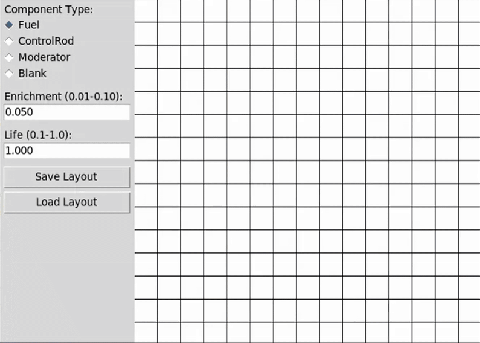

# Reactor Fuel Optimizer

A modular 2D reactor core simulator and optimizer designed to evolve fuel assembly layouts over time. It supports configurable rules, logging, and future integration with optimization algorithms (e.g., PSO, GA).

---

##  Core Features

- **Grid-based simulator**  
  - 15×15 grid of assemblies, categorized into `Fuel`, `ControlRod`, `Moderator`, and `Blank`  
  - Only `Fuel` assemblies are movable/optimizable

- **Time evolution engine**  
  - Deterministic timestep loop (up to configurable `TIMESTEPS`)  
  - Each assembly updates attributes like `temperature`, `energy_output`, `life`  

- **Flexible initialization**  
  - Load predefined layouts via JSON  
  - Generate random or uniform configurations with seeded RNG  

- **Modular physics & penalty system**  
  - Swappable models (neighbor influence rules, fitness scoring)  
  - Stubbed fitness/penalty functions for plugin integration  

- **Extensible architecture**  
  - Organized into core modules (`core_sim/`, `optimizer/`, `utils/`, `visualisation/`)  
  - Clean separation between simulation, logging, and optimization

- **Data logging & export**  
  - Built-in recorder/logger outputs:  
    - Per-timestep grid states  
    - Total energy & fitness  
    - Penalty tracking

- **Branch-based development**  
  - The `almost-there` branch holds the latest working version  
  - Stable branching strategy for collaboration & integration

---


## 🛠️ Getting Started

1. **Clone the repo**
   ```bash
   git clone https://github.com/barteg/reactor-fuel-optimizer.git
   cd reactor-fuel-optimizer
   git checkout almost-there

2. **Instal depependencies**
  ```bash
  pip install -r requirements.txt
  ```
3. **Run a quick simulation**
  ```bash
  python main.py
```
## Layout Editor

Use the visual layout editor (layout_editor.py) to design your own reactor core layouts. You can place any combination of:

F — Fuel

C — Control Rod

M — Moderator

B — Blank

Export your layout to a JSON file and run it in the simulator.\
**Demo**: 



## Configuration & Extension
Config file
Edit simulation parameters in utils/config.py (e.g., TIMESTEPS).


Custom physics & penalties

Implement your logic inside core_sim/core_grid.py (for neighbor interactions)
